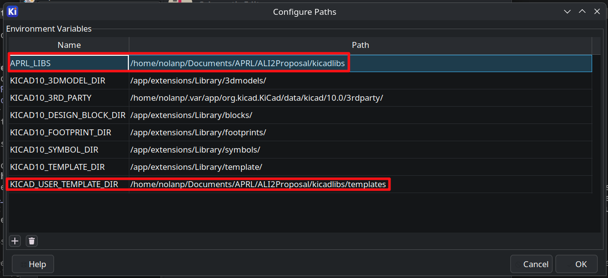

# APRL KiCad Projects

APRL KiCad Projects.

## Setup
First, clone the repository with `git clone`. GitHub has a button which gives you the command to do this.
Then, you will have to use `git lfs pull` to get all the 3D models and images.

The projects here rely on `APRL_LIBS` and `KICAD_USER_TEMPLATE_DIR` being set. You can do this by:

1. Going to Preferences > Configure Paths...
2. Setting `APRL_LIBS` to wherever you cloned this repo + `/kicadlibs`.
3. Setting `KICAD_USER_TEMPLATE_DIR` to whatever you set in (2) + `/templates`



## New ALI (Current Project for FQ2026)

### Design
The exigence of this endeavour is twofold:
1. To test the analog frontend designs of our proposed boards for DPF
2. To replace the confusing and elaborate ALI electronics with something that is far better documented and easier to use

The ALI itself can continue to be used for years to come and this reworking of the electronics will not impact it at all. This is going to be its own separate electrical box altogether. The ALI has the following additional limitations, too:
1. Limited I/O
2. Bonded grounds between +24/12/5V power supplies
3. Unknown board-level design decisions/trade-offs made in off-the-shelf components leading to strange artifacts in various measurements
4. Is generally really difficult to understand
5. Mixes bodge-wired custom electronics, off-the-shelf parts, and protoboards
6. Generally has fairly poor mounting
7. Makes use of fairly terrible connectors which are partially damaged and/or have shields which are not properly tied to case GND
8. Is completely full, thus making it impossible to add more electronics
9. Has no methods of cooling, sans the empty hold in the side of the box which completely negate the weather rating of the box itself
10. Uses heterogenous embedded computing ecosystems, requiring cross-domain knowledge of embassy, STM32Cube, and Arduino while doing every single one of them somewhat wrong in one way or another
11. Lacks feedback in many places (error logging namely)
12. Is generally just really hard to work with


Therefore, we have started work on a true replacement. Each of the modules serve a specific task, and are hooked to a common ethernet-based network which is far more performant than the original layout while simultaneously being easier to understand and expand. If you want more I/O, you can just simply add another board within a few minutes. Likewise, by opting for cutouts in the enclosure over dedicated port holes, it is also far easier to revise significant parts of the design without needing to drill through steel. 

#### Power
This system is +5V and +24V only, with +3.3V regulated on each board.

### CANBUS vs Ethernet
On the ground station, we are planning to use Ethernet instead of CANBUS. While this means our session protocol will not be tested in a real-world hotfire scenario, it does mean we can fully exploit each of the features offered by ethernet:
- Higher bandwidth (upwards of ~50x) means we don't have to throttle anything including error logging
- Natural isolation means we don't need any special tricks to get grounded thermocouples to work
- Is just generally far more pleasant to work with
- Does not limit future design decisions should we decide to reuse anything

Each of the modules will have a CAN transceiver anyway available for testing.

## Repository layout

```
kicadlibs/                                 Shared KiCad libraries, referenced as ${APRL_LIBS}
  aprl/                                      APRL's custom symbols and footprints
  aprl/*-noct.pretty                         "aprl/" but without courtyards
  vendor/                                    Third-party libs
  kicad/                                     Vendored stock KiCad libraries
  models/                                    3D models
  APRL_*_Sheet.kicad_wks                     Drawing sheets
  jlcpcb-4layer.kicad_dru                    Canonical JLCPCB design rules
.github/scripts                              Helper scripts runnable via Just and GH actions


ali/v2/                                    New ALI electronics
ali/v1/                                    Old ALI electronics
ophio/                                     DPF Vehicle Boards
misc/                                      Other endeavours
```


## What's not in this repo
- Old code (incl thermocouple 1A's CubeMX and Embassy variants)
- Prototypes (pending ordering)
- ALI ADC hardware (pending import)

## AI Usage
You may use AI to research topics and to write one-off scripts which do minor modifications and automate tedious, minor tasks. For example, if you need to color in a bunch of models feel free to.

What you *cannot* use it for is end to end electrical design, layout, and documentation. Documents should be written by people, and a schematic falls under this category. Likewise, using AI to automate layout is A. ineffective because it does not generate high-quality layouts and B. defeats the purpose of this club, which is to learn about electronics.